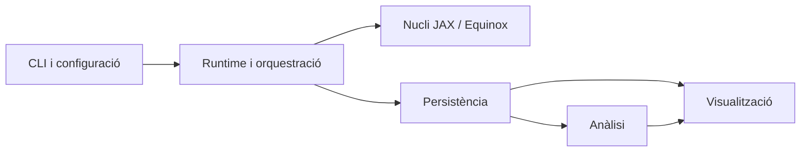
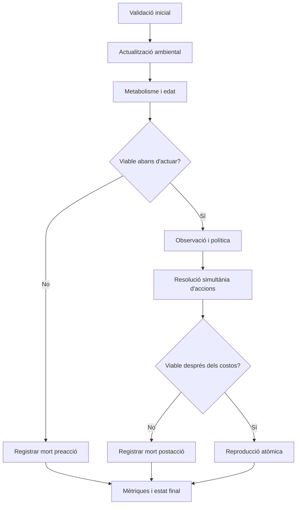
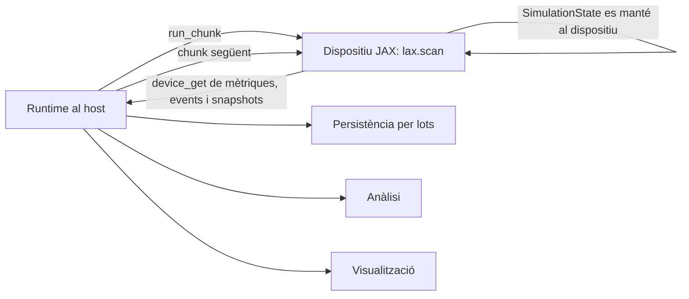

# PROJECTE EVOLUCIÓ

## Arquitectura tècnica del sistema

Estructura del paquet Python, dependències, límits de capes i decisions específiques sobre JAX i Equinox

Document de decisió tècnica per construir un prototip mínim, vectoritzat, reproduïble i científicament auditable, sense acoblar el motor evolutiu a la persistència ni a la presentació de resultats.

| **Camp** | **Valor** |
|---|---|
| Tipus de document | Especificació d’arquitectura tècnica |
| Versió | 1.0 |
| Data | 15 de juliol de 2026 |
| Estat | Aprovat per iniciar implementació |
| Àmbit | Prototip inicial de vida artificial evolutiva |
| Destinatari | CTO, direcció tècnica i equip de desenvolupament |

> **Decisió arquitectònica principal**
>
> El sistema s’implementarà com un nucli funcional pur, compilable amb JAX i estructurat amb Equinox, envoltat per una capa d’orquestració host que gestiona configuració, chunks d’execució, persistència, anàlisi i visualització. La població tindrà capacitat fixa per execució i es representarà amb arrays emmascarats, no amb objectes Python dinàmics.

# Control del document

| **Element** | **Definició** |
|---|---|
| Propietari tècnic | Projecte Evolució |
| Documents funcionals d’origen | Arquitectura general, abast, món 2D, agent, observacions, genoma/xarxa, accions, energia, reproducció, mort, bucle, mètriques, registre, persistència, proves i visualització. |
| Decisió funcional resolta | La viabilitat i la mort es resolen abans de permetre la reproducció. Un progenitor no pot generar descendència si, després de tots els costos aplicables, queda en estat inviable. |
| Canvis que obliguen a revisar aquest document | Canvi de topologia neuronal, població dinàmica sense capacitat fixa, execució distribuïda, aprenentatge individual, reproducció sexual o introducció de múltiples espècies. |

# Índex executiu

> 1\. Resum executiu
>
> 2\. Principis i abast tècnic
>
> 3\. Arquitectura per capes
>
> 4\. Estructura del paquet Python
>
> 5\. Responsabilitats i dependències entre mòduls
>
> 6\. Model tècnic de dades del nucli
>
> 7\. Bucle temporal i ordre de resolució
>
> 8\. Decisions específiques de JAX
>
> 9\. Decisions específiques d’Equinox
>
> 10\. Frontera entre dispositiu i host
>
> 11\. Persistència, anàlisi i visualització
>
> 12\. Configuració, versions i dependències
>
> 13\. Estratègia de proves
>
> 14\. Rendiment i operació
>
> 15\. Riscos i mitigacions
>
> 16\. Decisions d’arquitectura consolidades
>
> 17\. Criteris d’acceptació
>
> Annexos

# 1. Resum executiu

La proposta prioritza una simulació científicament interpretable i computacionalment eficient. La decisió crítica no és “usar JAX”, sinó estructurar l’estat i el flux perquè JAX pugui compilar-los sense formes dinàmiques, efectes laterals ni dependències d’infraestructura.

| **Decisió** | **Aplicació** | **Conseqüència** |
|---|---|---|
| Nucli pur i immutable | Cada pas transforma SimulationState + CoreConfig + PRNG key en un nou estat i sortides estructurades. | Proves deterministes, JIT estable i absència de SQL o I/O dins la simulació. |
| Capacitat poblacional fixa | max_agents és estàtic per execució; els slots lliures i els agents vius es controlen amb màscares. | Naixements i morts no canvien les formes dels arrays ni forcen recompilacions. |
| Execució per chunks | El runtime compila run_chunk i executa N passos amb lax.scan. | Redueix l’overhead de Python i crea punts segurs de persistència. |
| Política neuronal batched | Una topologia MLP fixa, amb paràmetres diferents per agent i una dimensió inicial de població. | Inferència vectoritzada amb vmap/filter_vmap i mutació sobre fulles del PyTree. |
| Mort abans de reproducció | Dos talls de viabilitat impedeixen actuar o reproduir-se a agents inviables. | Elimina descendència “suïcida” i resol la contradicció funcional detectada. |
| Adaptadors externs | PostgreSQL, Parquet/Zarr, MLflow, Polars i visualització viuen fora del nucli. | Canviar la infraestructura no obliga a reescriure les regles ecològiques. |

> **Recomanació de CTO**
>
> No construir una capa de microserveis, una interfície web ni una abstracció genèrica de “motor d’agents” en aquesta fase. El risc principal és sobreenginyeria abans de validar el bucle evolutiu. El primer lliurable ha de ser un paquet Python executable, amb CLI i proves, que pugui córrer sense base de dades.

# 2. Principis i abast tècnic

## 2.1 Principis no negociables

- L’estat de la simulació és explícit, complet i serialitzable; no es reparteix en singletons ni variables globals.
- Les regles ecològiques i evolutives són funcions pures o transformacions explícites d’estat.
- Els agents són dades en arrays poblacionals; no són instàncies Python amb mètodes que muten internament.
- La selecció emergeix de supervivència i reproducció; no existeix una funció externa que elimini o premiï genomes.
- La mètrica observa i resumeix, però no altera l’estat.
- La persistència pot fallar o estar desactivada sense canviar el resultat numèric del nucli.
- La visualització consumeix snapshots o dades persistides; mai no és una dependència d’execució.
- Configuració, seed, versió de codi i esquemes queden congelats per run.

## 2.2 Abast inclòs

**Aquest document fixa:** estructura del paquet, direcció de dependències, contractes de dades, estratègia de compilació, gestió de població variable sobre arrays fixos, ús d’Equinox, frontera de persistència, configuració i proves arquitectòniques.

## 2.3 Exclusions

| **Exclusió** | **Motiu** |
|---|---|
| Distribució multi-node o multi-host | Prematura fins conèixer el cost real del prototip. |
| Reproducció sexual o topologia neuronal evolutiva | Trencaria l’homogeneïtat de formes que simplifica la primera implementació. |
| Aprenentatge individual o gradients | Confondria evolució poblacional amb entrenament durant la vida. |
| API web dins el motor | Acoblaria el nucli a latència, serialització i gestió de sessions. |
| Persistència de cada agent a cada pas per defecte | El volum seria desproporcionat i podria dominar el temps d’execució. |
| Exactitud bit a bit entre acceleradors diferents | No és un requisit del prototip; es registra backend i versions per contextualitzar la reproduïbilitat. |

# 3. Arquitectura per capes

**La dependència principal és unidireccional:** interfícies → runtime → nucli. Persistència, anàlisi i visualització són adaptadors laterals invocats pel runtime, no pel nucli.



Figura 1. Capes lògiques i direcció permesa de dependències.

| **Capa** | **Responsabilitat** | **Pot importar** |
|---|---|---|
| core | Regles del món, agents, política, accions, evolució, mètriques de pas i motor compilable. | stdlib limitada, JAX i Equinox. |
| runtime | Inicialització d’un run, chunking, checkpoints, validació host, conversió device-host i ports. | core i contractes de configuració. |
| persistence | Adaptadors PostgreSQL, Parquet, Zarr i MLflow. | runtime/contracts; no és importat per core. |
| analysis | Càrrega, agregació, comparació de runs i llinatges. | esquemes persistits, Polars i llibreries estadístiques. |
| visualization | Mapes del món, sèries temporals i animacions. | snapshots i taules d’anàlisi; no core intern. |
| cli | Comandes per validar config, executar run, lots, exportar i visualitzar. | runtime i adaptadors seleccionats. |

> **Límit fort**
>
> Cap fitxer dins evolucio/core pot importar SQLAlchemy, psycopg, Polars, PyArrow, Zarr, MLflow, Matplotlib, FastAPI o codi de CLI. Aquesta regla s’ha d’automatitzar amb una prova d’arquitectura.

# 4. Estructura del paquet Python

L’estructura següent és específica per al prototip. Evita una arquitectura genèrica de plugins i manté cada responsabilitat prou petita per ser provada de manera aïllada.

```text
projecte-evolucio/
├── pyproject.toml
├── README.md
├── configs/
│ ├── base.yaml
│ ├── smoke.yaml
│ └── experiments/
├── src/evolucio/
│ ├── __init__.py
│ ├── config/
│ │ ├── models.py # Validació host i esquema versionat
│ │ ├── load.py # YAML/JSON → ExperimentConfig
│ │ └── compile.py # ExperimentConfig → CoreConfig
│ ├── core/
│ │ ├── types.py # Enums, aliases i convencions de dtype
│ │ ├── state.py # SimulationState i subestats PyTree
│ │ ├── rng.py # Derivació determinista de claus
│ │ ├── world/
│ │ │ ├── init.py
│ │ │ ├── resources.py
│ │ │ ├── occupancy.py
│ │ │ └── environment.py
│ │ ├── observations/
│ │ │ ├── build.py
│ │ │ └── normalize.py
│ │ ├── policy/
│ │ │ ├── model.py # PolicyMLP d’Equinox
│ │ │ ├── batch.py # PyTree batched de genomes
│ │ │ └── infer.py
│ │ ├── actions/
│ │ │ ├── types.py
│ │ │ ├── validate.py
│ │ │ ├── movement.py
│ │ │ ├── feeding.py
│ │ │ └── resolve.py
│ │ ├── evolution/
│ │ │ ├── viability.py
│ │ │ ├── reproduction.py
│ │ │ ├── mutation.py
│ │ │ └── genealogy.py
│ │ ├── metrics/
│ │ │ ├── step.py
│ │ │ ├── genetic.py
│ │ │ └── buffers.py
│ │ └── engine/
│ │ ├── step.py
│ │ ├── chunk.py
│ │ └── invariants.py
│ ├── runtime/
│ │ ├── ports.py # Protocols de registre i checkpoints
│ │ ├── run.py
│ │ ├── batch.py
│ │ ├── checkpoints.py
│ │ ├── dto.py # Device arrays → registres host
│ │ └── versioning.py
│ ├── persistence/
│ │ ├── postgres/
│ │ ├── parquet.py
│ │ ├── zarr_store.py
│ │ ├── mlflow_tracker.py
│ │ └── manifest.py
│ ├── analysis/
│ │ ├── loaders.py
│ │ ├── population.py
│ │ ├── lineages.py
│ │ ├── genetics.py
│ │ └── compare.py
│ ├── visualization/
│ │ ├── world.py
│ │ ├── timeseries.py
│ │ ├── lineages.py
│ │ └── animation.py
│ └── cli/
│ └── main.py
└── tests/
├── unit/
├── integration/
├── regression/
├── architecture/
└── fixtures/
```

| **Mòdul** | **Responsabilitat** | **Límit** |
|---|---|---|
| config | Valida paràmetres, separa camps estàtics/dinàmics i calcula hashes. | No conté estat de simulació ni activa JAX. |
| core.state | Defineix PyTrees d’estat amb arrays de forma fixa. | No inicialitza persistència ni llegeix fitxers. |
| core.world | Actualitza recursos, ambient i ocupació. | No decideix accions ni calcula fitness. |
| core.observations | Construeix el vector local normalitzat de mida fixa. | No modifica món ni agents. |
| core.policy | Aplica la MLP d’Equinox sobre genomes batched. | No valida legalitat ecològica de l’acció. |
| core.actions | Resol intencions de moviment i alimentació de forma simultània. | No crea descendents ni persisteix esdeveniments. |
| core.evolution | Viabilitat, reproducció, mutació i registres genealògics interns. | No selecciona els “millors” genomes. |
| core.metrics | Calcula mètriques de pas i actualitza acumuladors. | No modifica l’estat ecològic. |
| core.engine | Orquestra step i chunk, sense regles específiques amagades. | No coneix formats de fitxer o bases de dades. |
| runtime | Gestiona vida del run, chunks, checkpoints i adaptadors. | No reimplementa regles del nucli. |

# 5. Responsabilitats i dependències entre mòduls

## 5.1 Direcció interna del nucli

| **Mòdul consumidor** | **Dependències permeses** | **Dependències prohibides** |
|---|---|---|
| engine | state, rng, world, observations, policy, actions, evolution, metrics | runtime, persistence, analysis, visualization |
| metrics | state, events, types | engine, persistence, visualization |
| evolution | state, rng, policy.batch, types | engine, metrics agregades, persistència |
| actions | state, world, rng, types | evolution, persistence, policy intern |
| policy | types, batch, Equinox/JAX | world, actions, persistència |
| observations | state, world, types | policy, actions, evolution |
| world | state, rng, types | policy, evolution, metrics |
| state/types | JAX/Equinox i typing | qualsevol mòdul superior |

**Regla contra dependències circulars.** Les estructures compartides viuen a core.state o core.types. Els mòduls no s’importen mútuament per reutilitzar constants locals; aquestes constants s’eleven a types/config o es passen com a argument.

## 5.2 Ports d’infraestructura

**El runtime defineix protocols petits, orientats a operacions reals:** RunTracker, EventSink, MetricsSink, SnapshotStore i CheckpointStore. Els adaptadors implementen aquests ports. No es defineix un repositori genèric universal.

| **Port** | **Operacions mínimes** | **Implementació inicial** |
|---|---|---|
| RunTracker | start_run, log_params, log_summary, finish_run, fail_run | MLflow + metadades PostgreSQL |
| MetricsSink | append_metric_batch | Parquet i resum PostgreSQL |
| EventSink | append_births, append_deaths, append_genealogy | Parquet per lots; índex/resum a PostgreSQL |
| SnapshotStore | write_world_snapshot, write_population_snapshot | Zarr, activable per configuració |
| CheckpointStore | save, load, list_latest | Zarr + manifest JSON + hash |

# 6. Model tècnic de dades del nucli

## 6.1 Estat global com a PyTree

**SimulationState** és l’únic estat mutable conceptualment, però cada transformació retorna una nova versió. Es representa com un eqx.Module o dataclass registrat com a PyTree amb fulles JAX array.

| **Subestat** | **Camps principals** | **Forma orientativa** |
|---|---|---|
| SimulationState | step, rng_key, world, population, genomes, counters, metric_state | PyTree de formes fixes |
| WorldState | resources, environment, occupancy/density | [H,W], [H,W], [H,W] |
| PopulationState | alive, agent_id, parent_id, lineage_id, generation, position, energy, birth_step, age | [C], [C], [C,2] |
| GenomeBatch | w1, b1, w2, b2; opcionalment trets heretables | [C,O,H], [C,H], [C,H,A], [C,A] |
| MetricState | acumuladors necessaris per mètriques incrementals | escalars i vectors de mida fixa |
| StepOutput | mètriques, birth/death masks, causes, mutació resumida | arrays emmascarats de capacitat fixa |

**Convencions:** C = max_agents; H/W = dimensions del món; O = mida d’observació; Hn = unitats ocultes; A = nombre d’accions. Les formes són constants durant un run.

## 6.2 Capacitat fixa i població variable

JAX no és una bona base per afegir i eliminar files d’arrays dins una funció compilada. La variabilitat biològica es representa sobre una capacitat computacional fixa.

- max_agents és una propietat estàtica de l’experiment i determina la forma de compilació.
- alive[C] identifica slots actius; els morts alliberen slots després de generar l’esdeveniment corresponent.
- Els naixements es resolen sobre candidats emmascarats i s’assignen a slots lliures amb una regla determinista i vectoritzable.
- Un max_births_per_step estàtic limita el buffer de naixements i evita formes variables.
- La capacitat màxima és una protecció computacional; no s’ha d’interpretar com la pressió ecològica principal.
- S’ha de registrar birth_rejected_capacity per distingir saturació tècnica de saturació ecològica.

> **Decisió crítica**
>
> No s’utilitzaran llistes Python d’agents, append, delete ni un eqx.Module independent per slot creat dinàmicament. Qualsevol disseny que depengui de la longitud real de la població dins el JIT provocarà recompilacions, codi difícil de vectoritzar o transferències host-device innecessàries.

## 6.3 Dtypes i identificadors

| **Tipus** | **Decisió** | **Motiu** |
|---|---|---|
| Valors continus | float32 | Rendiment adequat en CPU/GPU i suficient per al model abstracte. |
| Índexs, steps i IDs interns | int32 | Capacitat suficient per run; evita habilitar x64 globalment. |
| Estat vital i màscares | bool | Operacions vectoritzades clares. |
| Enums d’acció i mort | int8 o int16 | Buffers compactes; conversió a etiquetes al host. |
| Identitat persistent | run_id extern + agent_id int32 intern | Unicitat global sense penalitzar el nucli. |

# 7. Bucle temporal i ordre de resolució

**La contradicció funcional s’ha resolt a favor de la viabilitat:** la reproducció és posterior als talls de mort i només és vàlida si el progenitor conserva energia viable després del cost reproductiu.



Figura 2. Ordre tècnic del pas temporal amb viabilitat prèvia a la reproducció.

| **Fase** | **Entrada** | **Sortida / invariant** |
|---|---|---|
| 1\. Validació inicial | SimulationState | Sense IDs duplicats, NaN, recursos negatius ni agents vius fora del món. |
| 2\. Actualització ambiental | WorldState + key del subsistema | Recursos regenerats i canvis ambientals aplicats abans de l’observació. |
| 3\. Metabolisme i edat | Agents vius | Energia debitada i edat incrementada. |
| 4\. Viabilitat preacció | Energia, edat, estat | Morts registrades; aquests slots no observen ni actuen. |
| 5\. Observació i política | Estat coherent únic | Observations[C,O], action_scores[C,A], action_code[C]. |
| 6\. Resolució d’accions | Accions candidates i món | Moviment/alimentació/conflictes resolts simultàniament. |
| 7\. Viabilitat postacció | Energia després de costos i guanys | Agents inviables retirats abans de reproducció. |
| 8\. Reproducció atòmica | Candidats vius, energia i slots lliures | Cost, mutació, naixement i genealogia aplicats com una operació coherent. |
| 9\. Mètriques i estat final | Estat final i events | Balanç poblacional quadrat i buffers emmascarats emesos. |

**Condició reproductiva final.** energy_parent_after_all_costs \> death_threshold. El llindar reproductiu i l’edat mínima continuen sent condicions addicionals. Un intent que no compleix la condició no crea descendent ni aplica el cost complet.

# 8. Decisions específiques de JAX

## 8.1 Unitat de compilació

**La funció compilada principal serà run_chunk(state, core_config, n_steps_static).** A l’interior, lax.scan aplica step_fn durant un nombre fix de passos. No es dispersarà jit per totes les funcions petites; això complica perfils i recompilacions sense aportar necessàriament rendiment.

| **Decisió JAX** | **Aplicació concreta** | **Risc controlat** |
|---|---|---|
| lax.scan per temps | Executar 32–512 passos per chunk, segons memòria i volum de sortida. | Elimina bucles Python per tick. |
| vmap/filter_vmap per població | Observacions i política sobre l’eix C. | Evita iterar agent per agent. |
| Formes estàtiques | H, W, C, O, Hn, A i chunk_size constants per executable. | Evita recompilacions per població variable. |
| PyTrees explícits | Estat, configuració compilada i genomes. | Manté signatures llegibles i transformables. |
| Màscares | alive i valid masks controlen efectes sense canviar formes. | Evita branching Python i arrays ragged. |
| Control flow JAX | lax.cond/where/switch només on cal. | Evita errors de tracing per if sobre arrays. |
| Una transferència per chunk | device_get de sortides seleccionades. | Redueix sincronitzacions i I/O dins el bucle. |

## 8.2 Aleatorietat reproduïble

- Usar jax.random.key(seed) i claus tipades; no utilitzar l’estat aleatori global de NumPy ni random dins del nucli.
- Derivar claus per step i subsistema amb fold_in o split en una jerarquia estable: inicialització, ambient, conflictes, reproducció i mutació.
- Per conflictes, generar prioritats a partir de step, tipus de conflicte i agent_id, no de l’ordre accidental de l’array.
- No dividir claus segons el nombre actual d’agents vius; això faria que una mort alterés tota l’aleatorietat posterior de manera poc controlable.
- El checkpoint conserva la clau exacta i el step, no només la seed original.

```text
seed mestra
└── key_run
├── fold_in(step, ENVIRONMENT)
├── fold_in(step, MOVEMENT_CONFLICT)
├── fold_in(step, FEEDING_CONFLICT)
└── fold_in(step, REPRODUCTION)
└── fold_in(agent_id) → mutació / desempat individual
```

## 8.3 Configuració estàtica i dinàmica

| **Categoria** | **Exemples** | **Tractament** |
|---|---|---|
| Estàtica | dimensions, max_agents, topologia, mida observació, chunk_size, límits tancats | Valors Python/static; canvi implica recompilació i nou executable. |
| Dinàmica | cost basal, cost moviment, regeneració, llindars, taxa/intensitat de mutació | Escalars JAX de dtype fix; poden variar entre runs sense canviar formes. |
| Host-only | rutes, credencials, freqüència de persistència, nom d’experiment | No entra a la funció compilada. |

**Criteri de recompilació.** El runtime calcula una compile_signature amb només els camps estàtics. Configuracions amb la mateixa signatura poden reutilitzar l’executable compilat, encara que variïn costos o taxes dinàmiques.

## 8.4 Diagnòstic i rendiment

- Mode eager amb mons petits per depurar regles i comparar contra la versió compilada.
- Mode debug compilat amb invariants seleccionats; no activar comprovacions costoses en producció per defecte.
- Mesurar temps després de block_until_ready per evitar benchmarks falsos per execució asíncrona.
- Registrar compilació i execució separadament; el primer run no és comparable amb runs calents.
- No introduir sharding, pmap o multi-device fins que un perfil demostri que un sol dispositiu és insuficient.

# 9. Decisions específiques d’Equinox

## 9.1 Paper d’Equinox

**Equinox s’utilitzarà per definir el model neuronal i estructures PyTree tipades, no com una capa d’entrenament.** No hi haurà optimizers, gradients ni estat de BatchNorm/Dropout en el prototip.

| **Element** | **Decisió** |
|---|---|
| PolicyMLP | eqx.Module feedforward amb una capa oculta i activació tanh. Topologia fixa per run. |
| Topologia inicial recomanada | 15 entrades → 16 unitats ocultes → 7 scores d’acció. Configurable dins el rang funcional, però estàtica. |
| Genoma batched | Fulles array del model apilades sobre l’eix C; camps estàtics compartits. |
| Inferència | eqx.filter_vmap o jax.vmap sobre el model/params i observacions. |
| Compilació | eqx.filter_jit a la frontera run_chunk perquè discrimina fulles array i no-array. |
| Mutació | jax.tree.map sobre fulles flotants, amb màscara Bernoulli i soroll gaussià acotat. |
| Serialització | El runtime exporta fulles de genoma amb esquema/topologia versionats; no persisteix repr() del mòdul. |

## 9.2 Representació recomanada del model poblacional

**No es mantindrà una llista de C PolicyMLP Python.** El model de referència defineix l’estructura del PyTree; les fulles numèriques s’apilen en arrays amb eix poblacional. Les operacions de còpia, mutació i inserció de descendents es fan fulla per fulla amb scatter funcional.

```text
PolicyMLP (topologia compartida)
├── layer1.weight : float32[C, hidden, obs]
├── layer1.bias : float32[C, hidden]
├── layer2.weight : float32[C, actions, hidden]
└── layer2.bias : float32[C, actions]

scores = filter_vmap(single_policy_forward)(genome_batch, observations)
```

> **Límit d’Equinox**
>
> No s’utilitzaran capes amb estat mutable, topologies diferents per agent ni mètodes Python que depenguin del valor d’un array durant el tracing. La simplicitat del model és una decisió de rendiment i d’interpretabilitat científica.

# 10. Frontera entre dispositiu i host



Figura 3. Execució compilada per chunks i persistència entre blocs.

## 10.1 Sortides del chunk

| **Sortida** | **Contingut** | **Política** |
|---|---|---|
| Final state | SimulationState complet al dispositiu | Es manté al dispositiu per al chunk següent. |
| Metric samples | Sèries cada record_stride o resum per step | Es transfereixen i s’escriuen per lots. |
| Birth/death events | Arrays fixos + valid mask | El runtime filtra les files vàlides i crea DTOs. |
| Snapshots | World/population només si el chunk coincideix amb interval | Transferència costosa i configurada explícitament. |
| Diagnostics | Invariants, overflow, capacitat rebutjada, NaN flag | Sempre en smoke/debug; resum en runs llargs. |

**Chunk size.** No es fixa un valor universal. El valor inicial recomanat és 128 passos, ajustat després de perfilar memòria, mida de buffers i temps de compilació. Ha de formar part de la signatura estàtica.

## 10.2 Efectes laterals

- Totes les escriptures es fan després de jax.device_get i fora de filter_jit.
- La persistència inicial és síncrona per chunk; una cua asíncrona només s’afegirà si el perfil mostra un coll d’ampolla real.
- Un error d’escriptura marca el run com a fallit, però no s’intenta reconstruir silenciosament un estat parcial sense checkpoint vàlid.
- Els callbacks host dins el JIT queden exclosos del camí normal perquè compliquen portabilitat, rendiment i raonament sobre efectes.

# 11. Persistència, anàlisi i visualització

## 11.1 Persistència híbrida

| **Destí** | **Responsabilitat** | **No s’hi guarda** |
|---|---|---|
| PostgreSQL | experiments, runs, config hash, agents resumits, genealogia, genomes destacats, índexs i manifests | arrays de població per tick |
| Parquet | mètriques temporals, events, resums d’agents i llinatges | estat multidimensional dens |
| Zarr | snapshots de món/població i checkpoints | metadades relacionals petites |
| MLflow | paràmetres, mètriques de resum, estat del run i artefactes referenciats | tota la telemetria d’alta freqüència |

**Implementació recomanada.** SQLAlchemy 2 amb psycopg 3 per PostgreSQL; Polars/PyArrow per Parquet; Zarr per arrays; MLflow com a tracker. Aquestes dependències s’instal·len com extres i no entren al nucli.

## 11.2 Anàlisi

- Polars és l’eina principal per taules i sèries; les consultes analítiques no recorren objectes del nucli.
- Els loaders validen schema_version, model_version i config_hash abans d’unir runs.
- La comparació entre experiments utilitza múltiples seeds i separa mètriques de run, llinatge i agent.
- Els càlculs genètics costosos poden carregar genomes seleccionats, no necessàriament tota la població de cada pas.

## 11.3 Visualització

- Matplotlib genera fotogrames, gràfics i dashboards estàtics; animacions curtes es construeixen a partir de snapshots mostrejats.
- La vista espacial rep un SnapshotDTO host, no SimulationState del dispositiu.
- La visualització en viu és opcional i limitada a runs curts; els experiments llargs treballen sense renderer.
- Cap color, gràfic o selecció visual es considera evidència d’adaptació sense mètriques i controls.

# 12. Configuració, versions i dependències

## 12.1 Esquema de configuració

**La configuració de l’usuari es valida al host amb Pydantic v2 i es congela en YAML o JSON.** Després es compila en CoreConfig, on els camps dinàmics són arrays escalares i els camps que defineixen formes són estàtics.

| **Bloc de configuració** | **Exemples** |
|---|---|
| world | width, height, resource_capacity, regeneration, environment schedule |
| population | initial_agents, max_agents, placement, max_births_per_step |
| policy | observation_schema_version, hidden_size, action_schema_version, activation |
| energy | initial/max energy, basal, movement, feeding conversion, reproduction threshold/cost |
| evolution | min_reproduction_age, mutation rate/sigma/clipping, max_age |
| runtime | steps, chunk_size, record_stride, snapshot_stride, backend |
| persistence | level, destinations, paths, batching, checkpoint_stride |

**Immutabilitat.** Un run no pot modificar la configuració congelada. Un canvi de paràmetre crea un run nou, encara que es reprengui d’un genoma o snapshot anterior.

## 12.2 Dependències de paquet

| **Grup** | **Dependències** | **Criteri** |
|---|---|---|
| core | jax, equinox | Versions bloquejades per lockfile i provades conjuntament. |
| config/CLI | pydantic, PyYAML, typer | Fora del JIT; errors clars abans d’executar. |
| persistència | sqlalchemy, psycopg, pyarrow/polars, zarr, mlflow | Extres opcionals; el core no en depèn. |
| visualització | matplotlib, imageio o backend equivalent | Extra opcional. |
| qualitat | pytest, hypothesis, ruff, pyright, import-linter, coverage | Dependències de desenvolupament. |

**Política de versions.** pyproject.toml declara rangs compatibles i el repositori conserva un lockfile reproduïble. Els runs registren versions efectives de Python, JAX, jaxlib, Equinox i backend. Les actualitzacions de JAX/Equinox passen primer per smoke, regressió amb seeds fixes i benchmarks.

# 13. Estratègia de proves

## 13.1 Piràmide de validació

| **Nivell** | **Objectiu** | **Exemples** |
|---|---|---|
| Unitàries | Regles locals pures | regeneració, normalització, costos, mutació zero/positiva, causa de mort |
| Propietats/invariants | Condicions que sempre han de complir-se | recursos ≥ 0, energia viva \> llindar, IDs únics, balanços poblacionals |
| Integració | Diverses fases del step amb món petit | alimentació + mort, reproducció + slot, conflicte simultani |
| Eager vs JIT | Equivalència del mateix escenari | mateix estat i outputs amb tolerància definida |
| Regressió | Detectar canvis involuntaris | fixtures amb seed fixa, config i hash de mètriques/sortides |
| Arquitectura | Fer complir límits d’importació | core no importa adaptadors; anàlisi no modifica core |
| Rendiment | Evitar regressions grans | temps per chunk, agents/s, memòria i compilació |

## 13.2 Escenaris obligatoris abans d’experiments llargs

- Món buit: un agent perd energia i mor amb causa ENERGY_DEPLETION.
- Recurs únic: l’alimentació redueix recurs i incrementa energia sense superar el màxim.
- Moviment bloquejat: cap posició surt dels límits.
- Mutació zero: genoma fill idèntic al progenitor en les fulles heretables.
- Reproducció possible: el progenitor queda viable, el fill rep slot/ID/genoma i el balanç quadra.
- Reproducció suïcida: un progenitor que quedaria inviable després del cost no genera descendent.
- Conflicte neutral: reordenar físicament els slots no canvia el guanyador si es conserva agent_id i key.
- Repetibilitat: config, codi, backend i seed idèntics produeixen els mateixos resultats.
- Checkpoint: reprendre conserva step, RNG, població, genomes i trajectòria posterior.

> **Porta de qualitat**
>
> Cap run llarg ni conclusió evolutiva es considera vàlida si fallen invariants, equivalència eager/JIT o la prova específica que impedeix reproducció d’un progenitor inviable.

# 14. Rendiment i operació

## 14.1 Modes d’execució

| **Mode** | **Característiques** | **Ús** |
|---|---|---|
| smoke | CPU, món petit, pocs passos, invariants complets, persistència mínima | CI i desenvolupament ràpid |
| debug | eager o chunk curt, snapshots freqüents, events detallats | diagnòstic de regles i divergències |
| experiment | JIT, chunks mitjans, mètriques i events, snapshots espaiats | execucions científiques normals |
| benchmark | persistència mínima, warm-up separat, block_until_ready | mesurar capacitat i regressions |

## 14.2 Ordre d’optimització

1. Primer: eliminar bucles Python per agent i assegurar formes fixes.
2. Segon: compilar el chunk complet i reduir transferències device-host.
3. Tercer: ajustar chunk_size i buffers segons perfils.
4. Quart: optimitzar càlcul d’ocupació, conflictes i diversitat genètica.
5. Només després: valorar donation de buffers, sharding o múltiples dispositius.

**Mètriques de rendiment obligatòries:** temps de compilació, temps per chunk calent, passos/s, agent-passos/s, mida màxima de població observada, transferència per chunk, volum persistit i memòria del dispositiu.

# 15. Riscos i mitigacions

| **Risc** | **Impacte** | **Mitigació decidida** |
|---|---|---|
| Capacitat fixa massa baixa | Naixements rebutjats per límit tècnic i selecció artificial. | Dimensionar amb marge, registrar rejects i repetir amb C més gran si és significatiu. |
| Capacitat fixa massa alta | Memòria i compilació excessives. | Perfilar configuracions representatives i separar perfils de mida. |
| Buffers d’esdeveniments grans | Sortides de scan massa pesades. | record_stride, chunk curt o resum/event masks seleccionats. |
| Recompilacions freqüents | Temps de run dominat per compilació. | Separar config estàtica/dinàmica i cachejar per compile_signature. |
| Aleatorietat dependent de l’ordre | Biaix ocult i regressions difícils. | fold_in per step/subsistema/agent_id. |
| Persistència dins el camí calent | Accelerador infrautilitzat i nucli acoblat. | device_get i escriptura per lots entre chunks. |
| Equinox utilitzat com OO tradicional | Un objecte per agent i actualitzacions difícils. | PyTree batched amb eix poblacional. |
| Diversitat genètica O(C²) | Cost desproporcionat en cada step. | Mostreig o càlcul per intervals fora del camí crític. |
| Conclusions basades en un run | Confusió entre selecció, deriva i seed afortunada. | Lots de seeds, controls i anàlisi separada. |

# 16. Decisions d’arquitectura consolidades

| **ID** | **Decisió** | **Estat** | **Conseqüència** |
|---|---|---|---|
| ADR-001 | Nucli funcional pur | Aprovat | Cap I/O ni dependència d’infraestructura dins core. |
| ADR-002 | Població amb capacitat fixa i màscares | Aprovat | max_agents estàtic per executable. |
| ADR-003 | Chunks compilats amb scan | Aprovat | Persistència només entre chunks. |
| ADR-004 | Agents com arrays poblacionals | Aprovat | No llistes d’objectes Python. |
| ADR-005 | MLP fixa 15-16-7 inicial | Aprovat | Pesos i biaixos evolucionen; topologia no. |
| ADR-006 | Equinox PyTree batched | Aprovat | filter_vmap/filter_jit i tree operations. |
| ADR-007 | RNG tipat i jeràrquic | Aprovat | Key explícita, fold_in estable. |
| ADR-008 | Viabilitat abans de reproducció | Aprovat | Cap descendent si el progenitor queda inviable. |
| ADR-009 | Persistència híbrida | Aprovat | PostgreSQL + Parquet/Zarr + MLflow. |
| ADR-010 | float32/int32 per defecte | Aprovat | x64 no s’habilita globalment. |
| ADR-011 | Sense multi-device al prototip | Aprovat | Només després de perfil real. |

# 17. Criteris d’acceptació

L’arquitectura es considerarà implementada, no només documentada, quan es compleixin els criteris següents:

- El paquet s’instal·la des de pyproject.toml i ofereix una CLI per validar configuracions i executar runs.
- Un run smoke funciona només amb les dependències del core i sense PostgreSQL, MLflow ni visualització.
- run_chunk està compilat i utilitza scan; la inferència de la població està vectoritzada.
- Naixements i morts no alteren les formes dels arrays i no provoquen recompilacions per mida poblacional.
- La prova de reproducció suïcida confirma que un agent inviable no genera descendència.
- La mateixa seed i configuració produeixen la mateixa sortida en el mateix entorn registrat.
- Core passa la prova d’arquitectura que impedeix imports d’infraestructura.
- Mètriques, naixements, morts i genealogia poden persistir-se per lots després de cada chunk.
- Un checkpoint reprèn la trajectòria amb el mateix estat i RNG.
- Els artefactes persistits porten run_id, config_hash, model_version i schema_version.
- L’anàlisi amb Polars i la visualització poden funcionar a partir de dades persistides, sense executar el motor.
- Hi ha un benchmark base que registra compilació, passos/s, agent-passos/s i memòria.

> **Conclusió tècnica**
>
> Aquesta arquitectura és prou estricta per aprofitar JAX i prou limitada per no convertir el prototip en una plataforma prematura. El principal compromís és acceptar capacitat fixa per run a canvi de compilació estable, vectorització clara i traçabilitat. És el compromís correcte per a la primera fase.

# Annex A. Contractes orientatius

## A.1 Signatures conceptuals del nucli

```python
def initialize(config: CoreConfig, key: PRNGKey) -> SimulationState: ...

def step(
    state: SimulationState,
    config: CoreConfig,
) -> tuple[SimulationState, StepOutput]: ...

@eqx.filter_jit
def run_chunk(
    state: SimulationState,
    config: CoreConfig,
    *,
    chunk_size: int, # estàtic
) -> tuple[SimulationState, ChunkOutput]: ...
```

## A.2 Invariants de final de pas

- population_count_next = population_count_prev + valid_births - valid_deaths
- alive implica energy \> death_threshold i age \< max_age
- resources dins [0, resource_capacity]
- cap agent viu fora de [0,W) × [0,H)
- agent_id únic dins el run; parent_id nul només per fundadors
- birth mask i death mask coincideixen amb els events emesos
- cap slot és simultàniament fill nou i mort en el mateix pas
- la clau RNG de sortida és diferent de la d’entrada i deriva de manera documentada

# Annex B. Documents funcionals utilitzats

- Document funcional d’arquitectura general del projecte, v1.0.
- Abast del prototip inicial, v0.1.
- Document funcional inicial i full de ruta.
- Model del món 2D.
- Model d’agent.
- Observacions disponibles per als agents.
- Genoma i xarxa neuronal.
- Accions possibles.
- Energia, recursos i metabolisme.
- Reproducció, herència i mutació.
- Mort i selecció ambiental.
- Bucle principal de simulació.
- Mètriques evolutives.
- Registre d’experiments.
- Persistència de dades.
- Proves bàsiques de validació.
- Visualització mínima.

# Annex C. Referències tècniques

- [JAX — PRNG keys i jax.random.key](https://docs.jax.dev/en/latest/jax.random.html)
- [JAX — PyTrees](https://docs.jax.dev/en/latest/pytrees.html)
- [JAX — jax.lax.scan](https://docs.jax.dev/en/latest/_autosummary/jax.lax.scan.html)
- [JAX — jax.vmap](https://docs.jax.dev/en/latest/_autosummary/jax.vmap.html)
- [Equinox — Transformations (filter_jit/filter_vmap)](https://docs.kidger.site/equinox/api/transformations/)
- [Equinox — Tricks: ensembles amb vmap](https://docs.kidger.site/equinox/tricks/)

**FI DEL DOCUMENT**
